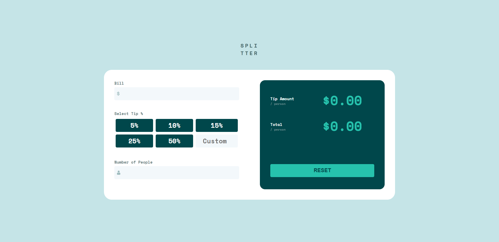
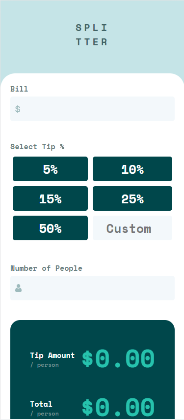
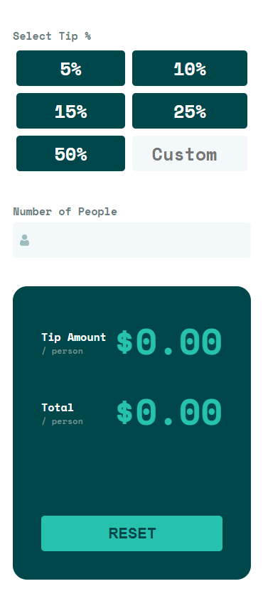

# Frontend Mentor - Tip calculator app solution

This is a solution to the [Tip calculator app challenge on Frontend Mentor](https://www.frontendmentor.io/challenges/tip-calculator-app-ugJNGbJUX).

## Table of contents

- [Overview](#overview)
  - [The challenge](#the-challenge)
  - [Screenshot](#screenshot)
- [My process](#my-process)
  - [Built with](#built-with)
  - [What I learned](#what-i-learned)
  - [Continued development](#continued-development)
- [Author](#author)

## Overview

### The challenge

Users should be able to:

- View the optimal layout for the app depending on their device's screen size (It is only optimized to only full screen page and mobile page under 375px. You can check this with Chrome developer tool)
- See hover states for buttons and inputs (color change)
- Calculate the correct tip and total cost of the bill per person(There is a bug of reloading page when you press enter in custom input. I didn't fix it yet😭)

### Screenshot



Mobile screen page



## My process

### Built with

- Semantic HTML5 markup
- CSS interactive style with JS
- Flexbox
- CSS Grid
- JS addEventListener

### What I learned

It has been a while that i coded Javascript, So it was quite a hard to remember how to use DOM.
What i learned is below

-how to get Element from Html with querySelector

```html
<input type="number" class="totalBill" />
```

```js
const bill = document.querySelector(".totalBill");
```

-how to apply addEventListener

```js
bill.addEventListener("keyup", keyupFuncOne);
function keyupFuncOne(evt) {
  let tempValue = evt.target.value;
  if (tempValue === "0" || tempValue === "") {
    evt.target.classList.add("hiddenThree");
    validateStyle.style.display = "block";
  } else {
    evt.target.classList.remove("hiddenThree");
    validateStyle.style.display = "none";
    billValue = Number(tempValue);
  }
}
```

-Using preventDefault function to prevent auto-reload page

```js
function keyupFuncThree(evt) {
  evt.preventDefault();
  let tempValue = evt.target.value;
  if (tempValue === "0" || tempValue === "") {
    evt.target.classList.add("hiddenThree");
  } else {
    evt.target.classList.remove("hiddenThree");
    percentValue = Number(tempValue);
  }

  for (let i of tipPercent) {
    if (i.classList[1] !== "custom") {
      i.classList.remove("selected");
    }
  }
}
```

### Continued development

I don't feel easy using DOM yet and thinking algorithm
Also, I realized i need to code more cocisely and prettier.
I'm gonna practice code refactoring and DOM more, and then Maybe try learning React.js and sass

## Author

- Website - [codernineteen](https://codernineteen.github.io/)
- Frontend Mentor - [@codertwenty](https://www.frontendmentor.io/profile/codertwenty)
- Instagram - [@politeynahc](https://www.twitter.com/politeynahc)
